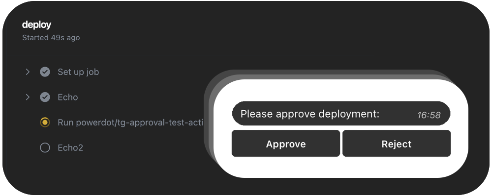

# Telegram Manual Approval

[@viz-A-viz](https://github.com/viz-A-viz) 🤜🤛 [@powerdot](https://github.com/powerdot)

Obtain manual approval for GitHub Actions workflows through Telegram messages. This action pauses a workflow and requires a manual response via Telegram to continue.

This action is particularly useful for deployment workflows where you want an extra layer of control before proceeding with sensitive operations like production deployment.



## How it works

1. When the workflow reaches the `telegram-manual-approval` step, it sends a customisable message containing approval and rejection buttons to a specified Telegram chat.
2. A user with appropriate permissions can click on the approval or rejection button within Telegram to continue or halt the workflow.
3. On approval, the workflow proceeds, and on rejection, the workflow fails and stops.

## Usage

To use this action, add the following step to your GitHub Actions workflow:

```yaml
steps:
  - uses: powerdot/telegram-manual-approval@main
    with:
      TELEGRAM_KEY: ${{ secrets.TELEGRAM_KEY }}
      TELEGRAM_CHAT_ID: ${{ secrets.TELEGRAM_CHAT_ID }}
```

Configure the inputs to customize the Telegram message:
- `TELEGRAM_KEY`: Your Telegram Bot key. (*This should be stored securely in your repository secrets*)
- `TELEGRAM_CHAT_ID`: The Telegram chat ID where approval requests will be sent.
- `APPROVAL_TEXT`: Custom message text prompting for approval.
- `APPROVAL_BUTTON`: Text for the approval button.
- `REJECT_BUTTON`: Text for the rejection button.
- `APPROVED_TEXT`: Message to indicate successful approval.
- `REJECTED_TEXT`: Message to indicate successful rejection.
- `TIMEOUT_TEXT`: Message to indicate a timeout if no response is received.
- `UPDATE_REQUESTS`: The number of update requests the action will make to check for manual approval or rejection via Telegram. This is not a strict timeout but rather a count of checks, with each request occurring approximately every 1 to 2 seconds.

You can also set a timeout limit for the approval step using `timeout-minutes` in your workflow file:

```yaml
steps:
  - uses: powerdot/telegram-manual-approval@main
    timeout-minutes: 10
    with:
      ...
```

Please note that the `TIMEOUT_TEXT` message is specifically related to the `UPDATE_REQUESTS` input and will only be sent if the maximum number of update requests is reached before a manual approval or rejection is received via Telegram. It does not correspond to the `timeout-minutes` parameter of the workflow step.

The `timeout-minutes` parameter in your workflow determines the maximum duration that the action will wait for an approval response before the step times out. If this workflow step timeout is reached without an approval or rejection, the action will simply cease to operate and will not send the `TIMEOUT_TEXT` message.

Additionally, the `UPDATE_REQUESTS` input is not a direct timeout setting but rather represents the limit of update checks the action will perform. It is set to a default of 60, which typically corresponds to a duration of 60 to 120 seconds depending on network conditions and server response times, as each update request is expected to occur roughly every 1 to 2 seconds. Adjust the `UPDATE_REQUESTS` value according to how long you want the action to wait for a response in Telegram before considering it a timeout situation and sending the `TIMEOUT_TEXT` message.

### Permissions

Ensure that the GitHub token used by the action has permissions to send messages via Telegram Bot API. You may not need to set any special permissions in your GitHub workflow for this action unless your workflow requires additional steps that interact with the GitHub environment.

### Quick example
```yaml
name: My job
on:
  push:
    branches: [ "main" ]
jobs:
  deploy:
    runs-on: ubuntu-latest
    steps:
      - name: Echo
        run: |
            echo "Hello World"
      - uses: powerdot/telegram-manual-approval@main
        with:
          TELEGRAM_KEY: "${{ secrets.TELEGRAM_KEY }}"
          TELEGRAM_CHAT_ID: "${{ secrets.TELEGRAM_CHAT_ID }}"
      - name: Echo2
        run: |
          echo "Hello World2"
```

## Development and Contribution
We welcome contributions and improvements from the community!

---
This GitHub Action is provided "as is" with no warranty. Usage of this action is at your own risk. For complete instructions on how to create and configure Telegram bots, please refer to the [official Telegram Bot documentation](https://core.telegram.org/bots).

For support and contributions, feel free to open an issue or a pull request in the [repository](https://github.com/powerdot/telegram-manual-approval).

Good luck with automating your workflows!
